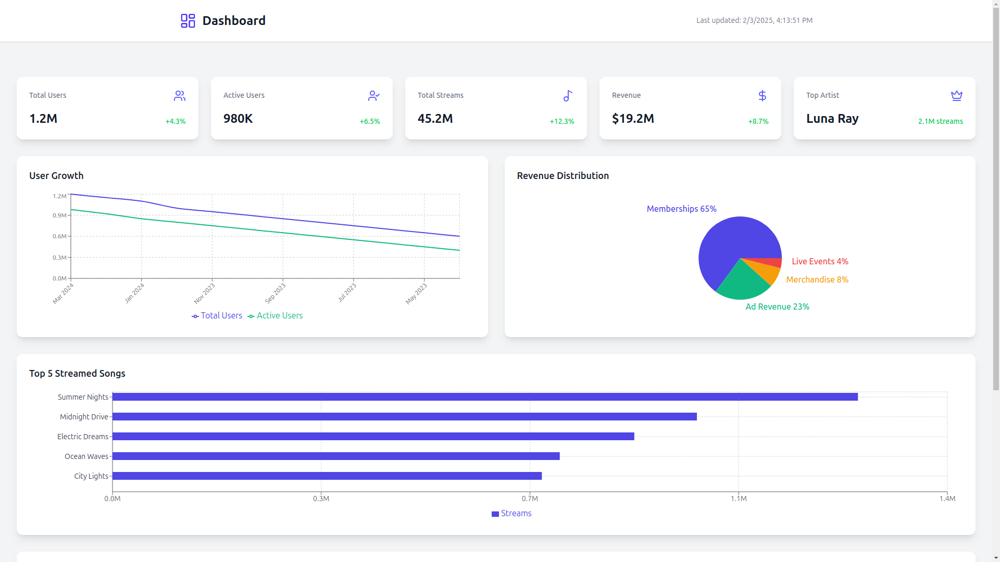
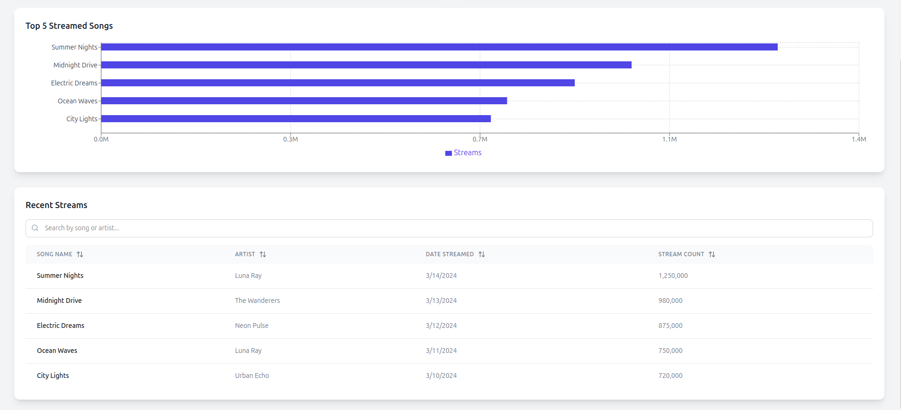

# Streamify

## Overview

This project is designed to provide an intuitive and efficient way to visualize data using interactive charts. The application is built using React.js, TypeScript, Recharts and TailwindCSS, ensuring a seamless user experience with a modern UI.

<video src="https://raw.githubusercontent.com/NishantCoder108/streamify/video-assests/PlantD%20_%20Colosseum%20Hackthon%20Week%202%20Update.mp4" controls width="100%"></video>


## Live Demo

Check out the live version here:  
🔗 [Live Demo](https://streamify-analytic-dashboard.netlify.app/)

## Features

- Interactive charts with tooltips
- Data visualization
- Responsive and optimized UI
- Lightweight and fast performance

## How to Run the Project

### Prerequisites

- Node.js (Latest LTS recommended)
- npm or yarn

### Installation

```sh
# Clone the repository
git clone https://github.com/NishantCoder108/streamify.git
cd streamify

# Install dependencies
npm install
```

### Running the Application

```sh
npm run dev
```

The application will be available at `http://localhost:5173/`.

## Screenshots

### Homepage





## Trade-offs & Challenges Faced

### 1. UI Design Complexity

One of the biggest challenges was deciding the UI structure. To tackle this:

- I broke down the requirements into small steps based on the documentation.
- Created a mind map to visualize the flow of the application.

### 2. Chart Library Selection

Choosing the right chart library was crucial for performance and usability. After evaluating multiple options, I selected one that offered:

- Flexibility in customization
- Lightweight and optimized rendering

### 3. Tooltip and Alignment Issues

While working on the chart, I faced issues with:

- Proper alignment of tooltips
- Ensuring smooth interaction

To resolve this:

- I explored GitHub issues related to the library.
- Experimented with different configurations and styling.
- Applied a custom solution based on community recommendations.

## Conclusion

This project was a great learning experience, from breaking down requirements effectively to resolving technical challenges.
